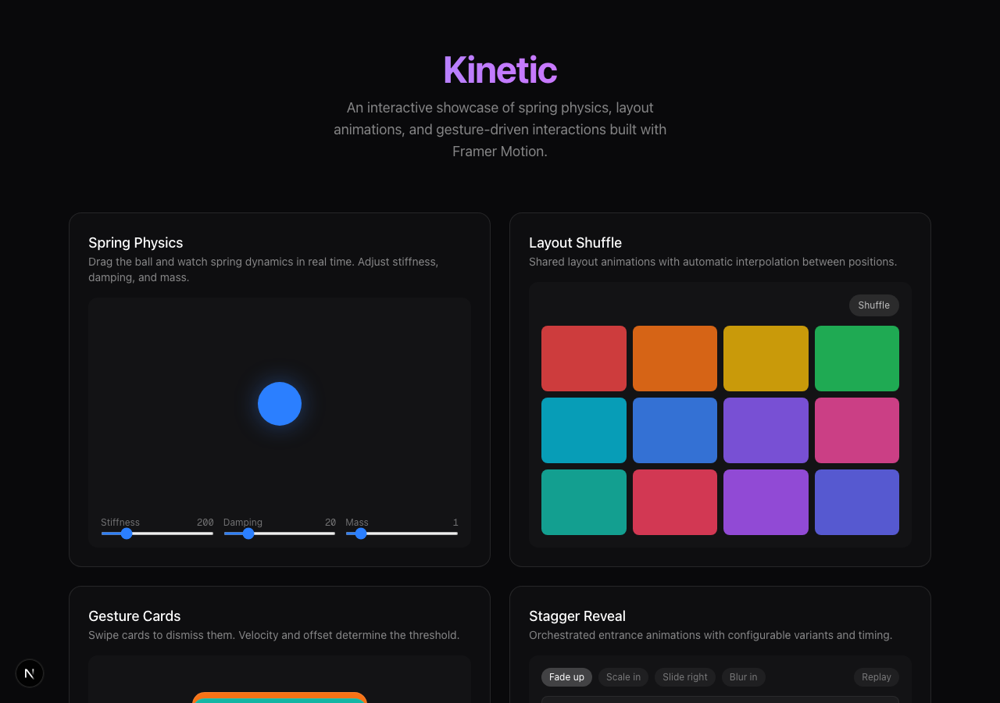

# Kinetic

An interactive showcase of spring physics, layout animations, and gesture-driven interactions built with Framer Motion.



## Demos

25 interactive demos covering core Framer Motion concepts:

- **Spring Physics** -- draggable ball with real-time stiffness, damping, and mass controls
- **Layout Shuffle** -- shared layout animations with click-to-expand
- **Gesture Cards** -- swipe-to-dismiss deck with velocity detection
- **Stagger Reveal** -- orchestrated entrance animations with four variants
- **Morphing Shapes** -- SVG path morphing with matched bezier segments
- **Path Drawing** -- SVG stroke animation using pathLength
- **Magnetic Hover** -- cursor-following buttons with spring physics
- **Drag to Reorder** -- sortable list with layout animation
- **3D Flip Cards** -- perspective card flip with spring transitions
- **Elastic Counter** -- spring-interpolated number animation
- **Animated Tabs** -- sliding indicator with shared layoutId
- **Countdown Ring** -- circular progress with spring-animated timer
- **Particle Burst** -- click-triggered particle explosions
- **Accordion** -- collapsible sections with height animation
- **Text Scramble** -- character-by-character text resolve effect
- **Cursor Trail** -- rainbow trail with staggered spring delay
- **Progress Steps** -- multi-step bar with spring transitions
- **Floating Dock** -- macOS-style dock with proximity scale
- **Typewriter** -- character-by-character text with blinking cursor
- **Notification Stack** -- toast notifications with auto-dismiss
- **Spotlight Card** -- cursor-following radial gradient
- **Infinite Marquee** -- seamless looping ticker
- **Gravity Balls** -- drop and bounce with squash and stretch
- **Animated Border** -- rotating conic gradient border
- **Scroll Parallax** -- multi-layer parallax with useScroll

## Tech stack

- Next.js 16 (App Router)
- Framer Motion 12
- Tailwind CSS 4
- TypeScript

## Getting started

```bash
npm install
npm run dev
```

## Licence

MIT
